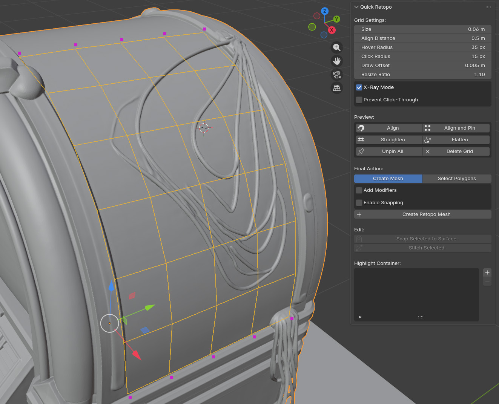

# Quick Retopo

**Quick Retopo** is a Blender addon designed to speed up the retopology process for 3D models. It allows you to interactively draw, extend, and modify a quad-based grid directly on the surface of a high-poly object. This provides a fast and intuitive workflow for creating clean, low-poly game or animation-ready assets.

---

## ✨ Main Features

*   **Interactive Grid Drawing**: Instantly generate a strip of quads by drawing a line on your high-poly model.
*   **Smart Extension**: Click green arrows on boundary edges to add new segments that inherit size and orientation.
*   **Surface-Aware Manipulation**:
    *   **Soft Move**: Drag quad centers with a falloff for organic adjustments.
    *   **Vertex Tweak**: Fine-tune individual vertices while snapping to the surface.
*   **Flexible Sizing**: Resize individual quads dynamically with the mouse wheel.
*   **Pinning System**: Lock specific vertices (purple) to exclude them from global straightening operations.
*   **Container & Docking**: Stitch new topology to existing meshes using the **Highlight Container** and **Align** tools.
*   **Grid Regularization**:
    *   **Straighten**: Even out the grid while respecting surface curvature.
    *   **Flatten**: Force the grid into a planar strip (great for hard-surface).
*   **Auto-Welding**: Merge vertices instantly using the interactive blue diamond handle.
*   **Selection Mode**: Use the grid brush to select polygons on the underlying mesh instead of creating new geometry.

---

## 🎮 Controls Cheat Sheet

| Action | Shortcut / Interaction | Visual Cue |
| :--- | :--- | :--- |
| **Draw Initial Strip** | `LMB` Drag on surface | Blue Line |
| **Add Segment** | Click **Green Arrow** on edge | Green Arrow |
| **Move Segment** | Drag **Cyan Circle** | Cyan Circle |
| **Resize Segment** | `Shift` + `Mouse Wheel` (over center) | Scale Change |
| **Delete Segment** | `Shift` + Click **Red Cross** | Red Cross |
| **Move Vertex** | `Ctrl` + Drag Vertex | Yellow Handle |
| **Pin / Unpin Vertex** | `Alt` + Click Vertex | Purple Dot |
| **Weld Vertices** | Click **Blue Diamond** (when close) | Blue Diamond |
| **Exit Preview** | `ESC` | - |

---

## 📦 Installation

1.  **Download** the latest `.zip` release.
2.  Open Blender and go to **Edit > Preferences > Add-ons**.
3.  Click **Install...**, select the ZIP file, and click **Install Add-on**.
4.  Enable **"Quick Retopo"** in the list.

**Requirements:**
*   Blender **3.3 LTS** or newer (Compatible with Blender 4.0+).

---

## 🚀 How to Use

### 1. Setup
*   Ensure you are in **Object Mode**.
*   Select your **high-poly reference model**.
*   Open the Sidebar (`N`) and go to the **Retopo** tab.
*   Adjust **Grid Settings** (Size, Align Distance, etc.) if needed.

### 2. Drawing & Extending
*   **Start Drawing**: Click the button and drag a line on your model to create the first strip.
*   **Start from Container**: If you have existing geometry in the *Highlight Container*, click this to spawn arrows on its edges and extend from there.
*   **Grow the Grid**: Hover over edges and click the **Green Arrows** to extrude new quads.

### 3. Refining & Editing
*   **Tweak**: Use the handles to move segments or `Ctrl`-drag vertices to fit the topology to the form.
*   **Resize**: Use `Shift + Wheel` to adjust the density of specific areas.
*   **Pinning**: Hold `Alt` and click vertices to "Pin" them. Pinned vertices act as anchors and won't move when you use the *Straighten* tools.
*   **Alignment**:
    *   Add existing meshes to the **Highlight Container**.
    *   Use **Align** or **Align and Pin** to snap your current grid's border to the container mesh.
    *   Use **Stitch Selected** to merge separate mesh islands later.

### 4. Finalizing
Once you are happy with the layout, check the **Final Action** section:

*   **Mode: Create Mesh** (Default)
    *   Optional: Check **Add Modifiers** (Subsurf + Shrinkwrap).
    *   Optional: Check **Enable Snapping** (Sets up Blender's face snapping automatically).
    *   Click **Create Retopo Mesh**.
*   **Mode: Select Polygons**
    *   Click **Select Polygons** to select the faces of the high-poly model that lie beneath your grid (useful for extracting parts of a mesh).

---

## 🔧 Support

If you encounter bugs or have feature requests, please open an issue on the GitHub repository.
